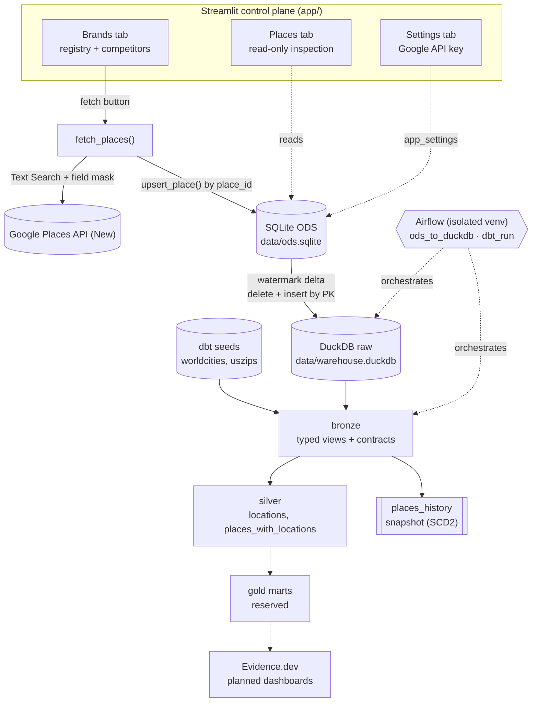

# Architecture: Competitive Whitespace Data Platform

**Status:** As-built (development)
**Last updated:** 2026-09-17
**Purpose:** Describes how the platform is actually built today, the decisions behind it, and what comes next: geographic competitive whitespace analysis for physical-store brands.

---

## 1. What this platform does

For a registered brand and its competitors, the platform answers: *where is this brand under- or over-covered relative to its competitors?*

It does this by:

1. Keeping a **brand registry** (brands + competitor links) as the system of record for what to compare.
2. Ingesting **store locations from the Google Places API (New)** into a loosely-typed Operational Data Store (ODS).
3. Incrementally landing ODS data into a **DuckDB warehouse** `raw` schema.
4. Modelling it through a **medallion pipeline** (`raw → bronze → silver → gold`) with dbt, using contracts, tests, and a snapshot for history.
5. Exposing an operator UI today (**Streamlit**) and analytical dashboards next (**Evidence.dev**).

---

## 2. Current state at a glance

| Layer | Technology | Artifact | Status |
|---|---|---|---|
| Control plane / UI | Streamlit | `app/` | Working (3 tabs) |
| Ingestion | Google Places API (New) | `src/whitespace_analyzer/ingestion/google_places.py` | Working |
| ODS | SQLite | `data/ods.sqlite` | Working (5 tables) |
| Landing | DuckDB `raw` schema | `data/warehouse.duckdb` | Working (watermark merge) |
| Bronze | dbt views | `dbt/models/bronze/` | Working (contracts + tests) |
| Silver | dbt incremental + snapshot | `dbt/models/silver/`, `dbt/snapshots/` | Working |
| Gold | dbt (reserved, no models) | `dbt/models/gold/` | Empty by design |
| Orchestration | Airflow 2.11 (isolated venv) | `airflow/` | Working (dev, standalone) |
| Dashboards | Evidence.dev | — | Planned |

Current development dataset: 2 brands, 81 places, 2 competitor links, 50,250 worldcities, 33,782 US ZIPs. `silver.locations` = 55,536 rows / 9,127 matched ZIPs; `silver.places_with_locations` = 81 rows (37 matched to a US location). 44 dbt tests, 24 pytest tests.

---

## 3. Architectural principles

- **Loose at the edge, strict before analytics.** The ODS and the DuckDB `raw` schema accept whatever the source produces. Typing, casting and validation happen once, at `bronze`, behind enforced contracts.
- **Idempotent by key.** Every hop is safe to re-run: Places upserts by `place_id`, ODS→raw merges by primary key, dbt incremental models use `delete+insert` on a key.
- **Zero infrastructure.** SQLite and DuckDB are embedded file-based engines; no servers, no Docker.
- **Orchestrated, not ad-hoc.** Airflow owns the scheduled steps so the same commands run in the same order every time.
- **Reference data as code.** Geographic reference data is versioned as dbt seeds, not fetched at runtime.
- **History is explicit.** Point-in-time change tracking is a first-class snapshot, not an afterthought.
- **Lineage & provenance.** Raw API payloads are retained (`places.raw_json`), watermark state is stored in the warehouse, and every mutable ODS row carries timestamps.

---

## 4. System architecture



Two data planes exist side by side and deliberately do not overlap:

- the **operational plane** (Streamlit ↔ SQLite ODS) for capture and editing;
- the **analytical plane** (DuckDB → dbt → dashboards) for modelling and reporting.

---

## 5. Technology stack

| Concern | Choice | Why |
|---|---|---|
| Language | Python 3.13 (uv, PEP 621) | Single toolchain for app, ingestion and dbt invocation. |
| UI / control plane | Streamlit | Fastest path to forms + dataframes; no frontend build. |
| Ingestion source | Google Places API (New), Text Search | Authoritative store data with ratings, hours, status and coordinates; replaces the earlier scraping/LLM approach entirely. |
| ODS | SQLite | Embedded, transactional, fine for registration + upsert workload. |
| Warehouse / OLAP | DuckDB | Embedded columnar engine; `sqlite` + `spatial` extensions; reads/writes the same file dbt uses. |
| Transformation | dbt Core + dbt-duckdb | Contracts, tests, snapshots, lineage; SQL models versioned with the app. |
| Orchestration | Airflow 2.11 in an isolated venv | Scheduling, retries and observable runs; version pinned because Airflow 3 dropped the SQLite metadata backend. |
| Spatial | DuckDB `spatial` extension | Needed for point construction and distance-based city matching. |
| Dashboards | Evidence.dev (planned) | Markdown + SQL dashboards reading DuckDB directly. |

---

## 6. Repository layout

```text
whitespace_analyzer/
├── app/                         # Streamlit control plane
│   ├── main.py                  # page config, three tabs, brand/competitor/Google sections
│   ├── places_page.py           # read-only Places tab (table + inspector + raw JSON)
│   └── settings_page.py         # Google Places API key form
├── src/whitespace_analyzer/
│   ├── ingestion/google_places.py   # Places API client + place_to_row + persist_places
│   ├── analytics/duckdb_ingest.py   # ODS → raw watermark merge
│   └── ods/
│       ├── database.py          # SQLite schema, migrations, worldcities seed loader
│       ├── brands.py            # create/list/exists
│       ├── competitors.py       # link/unlink/list + validation
│       ├── places.py            # upsert_place / list_places / get_place
│       ├── settings.py          # app_settings get/set with defaults
│       └── geo.py               # country/city lists + Places query builder
├── dbt/
│   ├── dbt_project.yml          # layer materials/schemas, snapshot target, seed types
│   ├── profiles.yml             # duckdb target, spatial extension
│   ├── macros/generate_schema_name.sql
│   ├── seeds/                   # worldcities.csv (50,250), uszips.csv (33,782)
│   ├── models/bronze/           # brands, places, competitors, app_settings (+ sources, schema)
│   ├── models/silver/           # locations, places_with_locations
│   ├── models/gold/             # reserved
│   ├── snapshots/places_history.sql
│   └── tests/                   # singular data-quality tests
├── airflow/
│   ├── pyproject.toml           # isolated py3.12 env (apache-airflow 2.11.0)
│   ├── airflow_env.sh           # env: AIRFLOW_HOME, sqlite conn, macOS workaround
│   ├── start_airflow.zsh        # one-command dev launcher
│   ├── dags/ods_to_duckdb.py    # hourly :00
│   ├── dags/dbt_run.py          # hourly :30, seed >> run >> snapshot >> test
│   └── airflow_home/            # runtime state (git-ignored: airflow.db, cfg, logs)
├── data/                        # git-ignored: ods.sqlite, warehouse.duckdb
└── tests/                       # pytest for ODS, ingestion and ingest logic
```

---

## 7. Data flow in detail

### 7.1 Ingestion — Google Places API (New)

Endpoint `places:searchText`, 20 results per page, up to 3 pages (60 places), with `X-Goog-FieldMask` restricting the payload.

- **Query construction** (`ods/geo.py`): `all {brand} in {city} city in {country}` when both are set; `all {brand} in {country} in all cities`; `all {brand} stores worldwide` when unscoped.
- **Field mask** requests: `id`, `displayName`, `formattedAddress`, `addressComponents`, `location`, `websiteUri`, `nationalPhoneNumber`, `internationalPhoneNumber`, `rating`, `userRatingCount`, `googleMapsUri`, `businessStatus`, `priceLevel`, `types`, `primaryType`, `utcOffsetMinutes`, `regularOpeningHours.openNow` + `weekdayDescriptions`, `currentOpeningHours.openNow`.
- **Cost note:** opening hours and `businessStatus` are billed at the Enterprise SKU, so the mask is deliberate rather than "everything".
- **Mapping** (`place_to_row`): `postal_code` is extracted from `addressComponents` (`longText`, falling back to `shortText`); `types` and `weekday_hours` default to `[]`; `open_now` is normalised to 0/1; the full API object is retained in `raw_json`.
- **Persistence** (`upsert_place`): insert-or-update keyed on `place_id`, refreshing `updated_at`.

### 7.2 ODS schema (SQLite)

| Table | Key | Notes |
|---|---|---|
| `brands` | `id` (autoincrement), `brand_name` UNIQUE | `industry_domain`, `website_url`, `created_at`. |
| `places` | `id` (autoincrement), `place_id` UNIQUE | All Google fields as columns + `raw_json`; `created_at`/`updated_at`. Indexed on `brand_id`. |
| `competitors` | composite (`brand_id`, `competitor_id`) | Self-links and non-existent brands rejected in `ods/competitors.py`. |
| `app_settings` | `key` | Currently only `google_places_api_key`. |
| `worldcities` | `id` | Loaded once from the seed CSV; powers the UI's country/city dropdowns. |

`init_schema()` is idempotent and also runs tiny forward migrations (`_migrate_places_columns` replaces the old `address_components` JSON blob with the scalar `postal_code`). The ODS is deliberately weakly typed: JSON blobs (`types`, `weekday_hours`, `raw_json`) are stored as TEXT.

### 7.3 ODS → DuckDB `raw` (watermark + merge)

`src/whitespace_analyzer/analytics/duckdb_ingest.py`. Not run by dbt — it is a Python step because dbt cannot attach a SQLite database and write to DuckDB in one model.

For each table in `INCREMENTAL_TABLES` (`brands`, `places`, `competitors`, `app_settings`):

1. Read the per-table watermark from `main._sync_watermarks` (created on first run).
2. Build `_ingest_delta` as either `SELECT * FROM ods_db.<t>` (first run) or `... WHERE <watermark_col> > <watermark>`.
3. `CREATE TABLE IF NOT EXISTS raw.<t> AS SELECT * FROM ods_db.<t> LIMIT 0` for schema discovery.
4. `DELETE FROM raw.<t> WHERE (<pk cols>) IN (SELECT <pk cols> FROM _ingest_delta)` then `INSERT INTO raw.<t> SELECT * FROM _ingest_delta`.
5. Advance the watermark to `MAX(<watermark_col>)` of the delta.

This is a **delete-then-insert merge by primary key**, so an updated place replaces its `raw` row rather than appending a duplicate. It is one SQL statement pair per table, not a row-by-row loop, and `(a, b) IN (SELECT a, b ...)` handles both single- and composite-key tables.

### 7.4 Bronze — typed views with contracts

`dbt/models/bronze/`. Four 1:1 views over `raw`, one per source table, each with `contract: {enforced: true}` and an explicit `cast()` per column:

- identifiers and counts → `BIGINT`; coordinates/rating → `DOUBLE`; `open_now` → `BOOLEAN`; timestamps → `TIMESTAMP`;
- `types`, `weekday_hours`, `raw_json` → `JSON` (casting to `JSON` also validates them);
- everything else → `VARCHAR`.

Because contracts require declared types, `_schema.yml` is both the type contract and the test suite:

- `not_null` on pipeline-guaranteed and analytics-required columns (keys, `name`, `formatted_address`, `latitude`, `longitude`, `business_status`, `utc_offset_minutes`, `open_now`, the JSON columns, timestamps);
- `unique` on `brands.id`, `brands.brand_name`, `places.id`, `places.place_id`, `app_settings.key`;
- `relationships` from `places.brand_id` and both `competitors` columns to `brands.id`;
- `accepted_values` on `business_status` and `price_level`.

Columns Google legitimately omits (`rating`, `user_rating_count`, `price_level`, `postal_code`, phones, `website_uri`, `primary_type`) are intentionally nullable.

Singular tests in `dbt/tests/` cover what generic tests cannot: value ranges (lat/lng/rating/counts), JSON *shapes* (`types`/`weekday_hours` arrays, `raw_json` object), competitor-pair uniqueness, and brand-not-own-competitor.

**Why bronze and not the ODS or `raw`:** a contract needs a layer that owns the type definition. Keeping `raw` as a faithful copy means a schema change or bad value fails in one place, is testable, and never blocks the ingest.

### 7.5 Silver — enrichment, history, and location matching

- **`locations`** (table, rebuilt each run): matches worldcities cities to US ZIPs. `lower(city)` + `country` + `lower(admin_name) = lower(state_name)`; then, per ZIP, the nearest city by `ST_Distance_Sphere` wins and must be within **75 km**. Every worldcities row is preserved (left-join semantics): losers fall back to an unmatched null ZIP. Output: `city, lat, lng, country, population, zip, state_name, density`, and it is unique per ZIP.
- **`places_history`** (snapshot, `unique_key=place_id`, timestamp strategy on `updated_at`, target schema `silver`): SCD2 over `bronze.places`, producing `dbt_valid_from`/`dbt_valid_to` and friends. Snapshots rather than a hand-rolled table because dbt already solves the change-detection edge cases.
- **`places_with_locations`** (incremental, `unique_key=place_id`, `delete+insert`): current snapshot rows (`dbt_valid_to is null`) filtered to `business_status = 'OPERATIONAL'`, left joined to `locations` on `postal_code = zip`, with `place_location`/`city_location` as `ST_Point`. The incremental predicate is `updated_at > (select max(updated_at) from {{ this }})`.

### 7.6 Gold — reserved

`dbt/models/gold/` is empty on purpose but configured (`+materialized: incremental`, `+schema: gold`) so the first mart lands in the right place. This is where the whitespace analysis belongs: per-ZIP penetration classification (`PENETRATED`, `COMPETITIVE_WHITESPACE`, `UNPENETRATED_WHITESPACE`), footprint benchmarks, and the competitive graph. Dashboards read from here, never from bronze/silver.

### 7.7 Reference data

`worldcities` and `uszips` ship as CSV seeds and are loaded by `dbt seed` into `bronze`, with `column_types` pinned in `dbt_project.yml` so `lat/lng` are `DOUBLE` and `population` is `BIGINT`. They are **not** fetched or synced by Python. `worldcities` also exists in the ODS, but only to populate the UI's country/city dropdowns — the warehouse copy is authoritative for modelling.

---

## 8. Orchestration — Airflow

Airflow exists so ingestion and modelling run on a schedule with retries and a run history, rather than when someone remembers. Today it runs standalone for development; the DAGs already define the production schedule, which is the hook for "schedule this properly later".

| DAG | Schedule | Tasks |
|---|---|---|
| `ods_to_duckdb` | hourly at `:00` | one `BashOperator` calling `uv run python -c "...ingest_ods_to_duckdb()"` |
| `dbt_run` | hourly at `:30` | `dbt_seed >> dbt_run >> dbt_snapshot >> dbt_test` |

Both are `catchup=False`, `max_active_runs=1` (single-writer safety on the DuckDB file), with one retry after 5 minutes.

**Isolated venv by design.** `airflow/pyproject.toml` pins Python `>=3.12,<3.13`, `apache-airflow==2.11.0`, `gunicorn==23.0.0`, `setproctitle==1.3.3`. Two reasons: Airflow 3 dropped the SQLite metadata backend (Airflow 2.11 is the last line that supports it), and Airflow's dependency tree should not constrain the main app's Python 3.13 environment.

`airflow/airflow_env.sh` sets `AIRFLOW_HOME`, points `SQL_ALCHEMY_CONN` at `airflow/airflow_home/airflow.db`, disables example DAGs, resolves all paths from the script's own location, and sets `OS_ACTIVITY_MODE=disable` — the workaround for a macOS fork race where `setproctitle` in forked gunicorn workers segfaults via CoreFoundation. `airflow/start_airflow.zsh` kills stale scheduler/webserver/triggerer processes and ports, then starts `airflow standalone`.

Airflow metadata is a **separate** SQLite file from the ODS. `airflow_home/` is runtime state and is git-ignored.

---

## 9. Presentation

**Today: Streamlit (`app/`)** — the operational control plane, reading and writing the SQLite ODS directly (never DuckDB).

- *Brands tab* — create a brand (name, industry domain, website, optional competitor links), per-brand competitor add/remove, and the Google Places fetch panel (country/city dropdowns from `worldcities`, live query preview, max results 1–60). Disabled with a hint until an API key is saved.
- *Places tab* — read-only: brand filter, table, and an inspector with timestamps, Google Maps link, parsed opening hours and the raw API payload.
- *Settings tab* — the single Google Places API key field.

There is **no authentication**, and the API key is stored in plaintext in `app_settings`. That is an accepted developer-mode decision, not an oversight — see §12.

**Next: Evidence.dev** — the analytical plane's dashboard layer, reading the DuckDB `gold` marts with SQL-in-Markdown, versioned alongside the models. Streamlit stays the write/control surface; Evidence owns reporting so the two concerns do not bleed into each other.

---

## 10. Testing and data quality

| Level | Tool | What it covers |
|---|---|---|
| ODS + ingestion Python | pytest (24 tests) | brands, competitors, settings, geo query building, Places mapping, and the watermark merge (full copy, merge-not-duplicate, no-resync, append). |
| Warehouse schema + data | dbt tests (44) | contracts/types, keys, relationships, enum values, ranges, JSON shapes. |
| Business rules | dbt tests (gold) | Not yet — lands with the gold marts. |
| Style | ruff | `src`, `app`, `scripts`, `tests`. |

`dbt_test` is the last task of the `dbt_run` chain, so a data-quality failure surfaces in Airflow before anyone reads the marts.

---

## 11. Decision log

| Decision | Choice | Why | Trade-off |
|---|---|---|---|
| Ingestion source | Google Places API (New) only | Authoritative, structured, no parsing/LLM cost or fragility | Paid API; Enterprise SKU for hours/status |
| Earlier scraping stack | Removed (Crawl4AI/LLM/Ollama) | Unreliable, slow, expensive to maintain | Lost non-Google sources |
| ODS engine | SQLite | Embedded, transactional; perfect for upsert workload | Single-writer |
| Warehouse engine | DuckDB | Embedded columnar; same file for ingest + dbt + dashboards | Single-writer; file locking |
| ODS → warehouse | Python watermark merge (not dbt) | dbt cannot attach SQLite and write DuckDB in one model | One bespoke step outside dbt |
| Merge semantics | Delete + insert by PK | Simple, idempotent, handles updates without duplicates | Explicitly loses ODS-side deletes |
| Typing boundary | Strict at `bronze` via contracts | One place to fail; raw stays a faithful copy | Bronze is no longer a pure passthrough |
| JSON handling | Cast to DuckDB `JSON` | Validity enforced by the cast, not just a test | Broken payload fails the view at query time |
| Snapshot | dbt snapshot on `places` | Native SCD2, handles change detection | Snapshot runs are separate from `dbt run` |
| City↔ZIP matching | City + country + state, then nearest by distance, 75 km cap | Same-name cities in one state made naive joins both fan out and wrong | ~50 ZIPs beyond 75 km fall back to unmatched |
| Reference data | dbt seeds | Versioned, reproducible, typed at load | Must be refreshed manually |
| Schedules | Airflow 2.11, SQLite backend, isolated py3.12 venv | SQLite metadata is dev-friendly; isolation keeps Airflow's deps out of the app env | Two environments to maintain |
| Auth | None on Streamlit | Developer-mode only | Not deployable as-is |
| Sync vs async ingestion | Synchronous, UI-triggered | Simplest thing that works for tens of brands | Long fetches block the Streamlit request |

---

## 12. Known limitations

- **ODS deletes do not propagate.** The watermark only sees rows that still exist, so a deleted ODS row stays in `raw` forever. Mitigation planned: soft-delete flag or a periodic reconcile.
- **`places_with_locations` lags geography changes.** It is incremental on `updated_at`, so rebuilding `locations` requires `dbt run --full-refresh --select places_with_locations` to re-enrich existing rows.
- **Status transitions leave stale rows.** If a place flips to `CLOSED_*`, the new snapshot version is filtered out but the previously-operational row remains in the incremental model until it is refreshed or deleted.
- **Location coverage is limited by worldcities.** It carries ~5.4k US cities, so many ZIPs (and all non-US postal codes) have no match — visible today as 37 of 81 places matched. That is a coverage limit, not a bug.
- **No auth, plaintext API key.** Intentional for local development.
- **Single-writer files.** SQLite and DuckDB both assume one writer; DAGs are pinned to `max_active_runs=1` and dbt runs at 1 thread.
- **Gold is empty.** There is no whitespace analysis yet — only the plumbing to support it.
- **Airflow runs are dev-grade.** `airflow standalone`, SQLite metadata, sequential executor, no secrets backend, no alerting.

---

## 13. Roadmap

1. **Gold marts** — `gold_zip_penetration` (per ZIP × brand presence), footprint benchmarks, and the competitive graph; then business-rule tests on top.
2. **Evidence.dev dashboards** — read `gold` from DuckDB: whitespace map, penetration KPIs, brand-vs-competitor comparison, data-quality page driven by dbt test results.
3. **Production scheduling** — move Airflow off `standalone`/SQLite to a real metadata backend and executor, add alerting, and reconsider the `:00`/`:30` cadence now that ingestion is long-running.
4. **Scheduled ingestion** — trigger Places fetches from Airflow instead of the UI so coverage grows without manual clicks.
5. **Delete propagation** — carry source deletions through `raw` (tombstones or reconcile) so downstream layers reflect closures.
6. **Location coverage** — a richer city/ZIP source, or a state-aware fallback, to lift the match rate beyond worldcities' major-cities list.
7. **Access control** — real auth and secret storage before any non-local deployment.

---

## 14. Running it

```bash
# UI (control plane)
uv run streamlit run app/main.py

# Warehouse + models (analytical plane)
uv run dbt seed    --project-dir dbt --profiles-dir dbt
uv run dbt run     --project-dir dbt --profiles-dir dbt
uv run dbt snapshot --project-dir dbt --profiles-dir dbt
uv run dbt test    --project-dir dbt --profiles-dir dbt

# Orchestration (dev, standalone; Ctrl-C stops everything)
./airflow/start_airflow.zsh

# Quality
uv run pytest -q
uv run ruff check src app scripts tests
```

Data stores (`data/*.sqlite`, `data/*.duckdb*`) and Airflow runtime state (`airflow/airflow_home/`, `airflow/.venv/`) are git-ignored.
