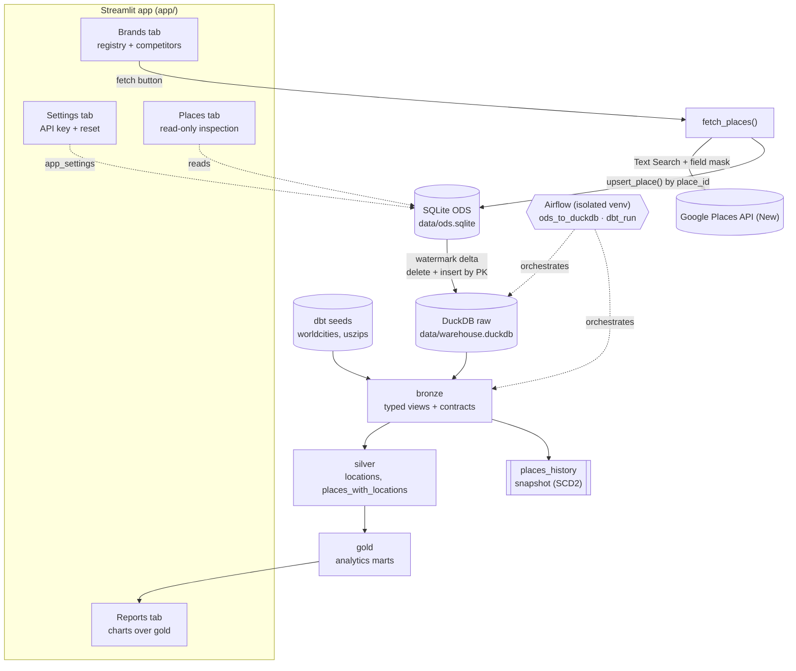

# Architecture: Competitive Whitespace Data Platform

**Purpose:** Defines the architecture of a configurable competitive whitespace platform for physical-store brands: how store locations are captured, modelled and analysed to show where a brand is under- or over-covered relative to its competitors.

---

## 1. Overview

For a registered brand and its competitors, the platform answers: *where is this brand under- or over-covered relative to its competitors?*

It works in two planes that deliberately never overlap:

- the **operational plane** — Streamlit over the SQLite ODS — captures brands, competitor links and store locations;
- the **analytical plane** — DuckDB, modelled with dbt — produces the analysis the Reports tab reads.

Data moves one way: Google Places → ODS → DuckDB `raw` → `bronze` → `silver` → `gold`.

## 2. Architectural principles

- **Loose at the edge, strict before analytics.** The ODS and the DuckDB `raw` schema accept whatever the source produces. Typing, casting and validation happen once, at `bronze`, behind enforced contracts.
- **Idempotent by key.** Every hop is safe to re-run: Places upserts by `place_id`, ODS→raw merges by primary key, dbt incremental models use `delete+insert` on a key.
- **Zero infrastructure.** SQLite and DuckDB are embedded file-based engines; no servers, no Docker.
- **Orchestrated, not ad-hoc.** Airflow owns the steps so the same commands run in the same order every time.
- **Reference data as code.** Geographic reference data is versioned as dbt seeds, not fetched at runtime.
- **History is explicit.** Point-in-time change tracking is a first-class snapshot, not an afterthought.
- **Lineage and provenance.** Raw API payloads are retained, watermark state is stored in the warehouse, and every mutable ODS row carries timestamps.

## 3. System architecture



## 4. Technology stack

| Concern | Choice | Why |
|---|---|---|
| Language | Python 3.13 (uv, PEP 621) | Single toolchain for app, ingestion and dbt invocation. |
| UI / control plane | Streamlit | Fastest path to forms and dataframes; no frontend build. |
| Ingestion source | Google Places API (New), Text Search | Authoritative store data with ratings, hours, status and coordinates. |
| ODS | SQLite | Embedded, transactional, well matched to the registration and upsert workload. |
| Warehouse / OLAP | DuckDB | Embedded columnar engine; `sqlite` and `spatial` extensions; the same file dbt and the Reports tab read. |
| Transformation | dbt Core + dbt-duckdb | Contracts, tests, snapshots and lineage; models versioned with the application. |
| Orchestration | Airflow 2.11 in an isolated venv | Scheduling, retries and observable runs. Pinned to 2.11 because Airflow 3 dropped the SQLite metadata backend. |
| Spatial | DuckDB `spatial` extension | Point construction and distance-based city matching. |
| Reporting | Streamlit Reports tab, Altair charts + pydeck store map | Reads the gold marts straight from DuckDB, so reporting ships with the app instead of a second deployment. |

## 5. Repository layout

```text
whitespace_analyzer/
├── app/                         # Streamlit app (control plane + reports)
│   ├── main.py                  # page config, four tabs, brand/competitor/Google sections
│   ├── places_page.py           # read-only Places tab (table + inspector + raw JSON)
│   ├── reports_page.py          # Reports tab: Altair charts + pydeck store map
│   └── settings_page.py         # API key form + danger-zone reset
├── src/whitespace_analyzer/
│   ├── ingestion/google_places.py   # Places API client + place_to_row + persist_places
│   ├── analytics/duckdb_ingest.py   # ODS → raw watermark merge
│   ├── analytics/brand_performance.py  # reads gold.brand_performance for the Reports tab
│   ├── analytics/store_map.py   # resolves our vs competitor store pins for the store map
│   └── ods/
│       ├── database.py          # SQLite schema, migrations, worldcities seed loader
│       ├── brands.py            # create/list/exists
│       ├── competitors.py       # link/unlink/list + validation
│       ├── places.py            # upsert_place / list_places / get_place
│       ├── settings.py          # app_settings get/set with defaults
│       └── geo.py               # country/city lists + Places query builder
├── dbt/
│   ├── dbt_project.yml          # layer materials/schemas, snapshot target, seed types
│   ├── profiles.yml             # duckdb target, spatial extension
│   ├── macros/generate_schema_name.sql
│   ├── seeds/                   # worldcities.csv, uszips.csv
│   ├── models/bronze/           # brands, places, competitors, app_settings (+ sources, schema)
│   ├── models/silver/           # locations, places_with_locations
│   ├── models/gold/             # analytics marts
│   ├── snapshots/places_history.sql
│   └── tests/                   # singular data-quality tests
├── airflow/
│   ├── pyproject.toml           # isolated py3.12 env (apache-airflow 2.11.0)
│   ├── airflow_env.sh           # env: AIRFLOW_HOME, sqlite conn, macOS workaround
│   ├── start_airflow.zsh        # one-command dev launcher
│   ├── dags/ods_to_duckdb.py    # hourly :00
│   ├── dags/dbt_run.py          # hourly :30, seed >> bronze >> snapshot >> run >> test
│   └── airflow_home/            # runtime state (git-ignored: airflow.db, cfg, logs)
├── data/                        # git-ignored: ods.sqlite, warehouse.duckdb
└── tests/                       # pytest for ODS, ingestion and ingest logic
```

## 6. Data flow in detail

### 6.1 Ingestion — Google Places API (New)

Endpoint `places:searchText`, 20 results per page, up to 3 pages (60 places), with `X-Goog-FieldMask` restricting the payload.

- **Query construction** (`ods/geo.py`): `all {brand} in {city} city in {country}` when both are set; `all {brand} in {country} in all cities`; `all {brand} stores worldwide` when unscoped.
- **Field mask** requests: `id`, `displayName`, `formattedAddress`, `addressComponents`, `location`, `websiteUri`, `nationalPhoneNumber`, `internationalPhoneNumber`, `rating`, `userRatingCount`, `googleMapsUri`, `businessStatus`, `priceLevel`, `types`, `primaryType`, `utcOffsetMinutes`, `regularOpeningHours.openNow` + `weekdayDescriptions`, `currentOpeningHours.openNow`.
- **Cost note:** opening hours and `businessStatus` are billed at the Enterprise SKU, so the mask is deliberate rather than "everything".
- **Mapping** (`place_to_row`): `postal_code` is extracted from `addressComponents` (`longText`, falling back to `shortText`); `types` and `weekday_hours` default to `[]`; `open_now` is normalised to 0/1; the full API object is retained in `raw_json`.
- **Persistence** (`upsert_place`): insert-or-update keyed on `place_id`, refreshing `updated_at`.

### 6.2 ODS schema (SQLite)

| Table | Key | Notes |
|---|---|---|
| `brands` | `id` (autoincrement), `brand_name` UNIQUE | `industry_domain`, `website_url`, `created_at`. |
| `places` | `id` (autoincrement), `place_id` UNIQUE | All Google fields as columns plus `raw_json`; `created_at`/`updated_at`; indexed on `brand_id`. |
| `competitors` | composite (`brand_id`, `competitor_id`) | Self-links and non-existent brands rejected in `ods/competitors.py`. |
| `app_settings` | `key` | Currently only `google_places_api_key`. |
| `worldcities` | `id` | Loaded once from the seed CSV; powers the UI's country/city dropdowns. |

`init_schema()` is idempotent and runs small forward migrations (`_migrate_places_columns` replaced the old `address_components` JSON blob with the scalar `postal_code`). The ODS is deliberately weakly typed: JSON payloads (`types`, `weekday_hours`, `raw_json`) are stored as TEXT.

### 6.3 ODS → DuckDB `raw` (watermark + merge)

`src/whitespace_analyzer/analytics/duckdb_ingest.py`. This is a Python step rather than a dbt model because dbt cannot attach a SQLite database and write to DuckDB within one model.

For each table in `INCREMENTAL_TABLES` (`brands`, `places`, `competitors`, `app_settings`):

1. Read the per-table watermark from `main._sync_watermarks`.
2. Build `_ingest_delta` as either `SELECT * FROM ods_db.<t>` (first run) or `... WHERE <watermark_col> > <watermark>`.
3. `CREATE TABLE IF NOT EXISTS raw.<t> AS SELECT * FROM ods_db.<t> LIMIT 0` for schema discovery.
4. `DELETE FROM raw.<t> WHERE (<pk cols>) IN (SELECT <pk cols> FROM _ingest_delta)` then `INSERT INTO raw.<t> SELECT * FROM _ingest_delta`.
5. Advance the watermark to `MAX(<watermark_col>)` of the delta.

This is a **delete-then-insert merge by primary key**, so an updated place replaces its `raw` row instead of appending a duplicate. It is one statement pair per table, not a row-by-row loop, and the row-value `IN` predicate covers both single-key (`places`) and composite-key (`competitors`) tables.

### 6.4 Bronze — typed views with contracts

Four 1:1 views over `raw`, one per source table, each with `contract: {enforced: true}` and an explicit `cast()` per column:

- identifiers and counts → `BIGINT`; coordinates and rating → `DOUBLE`; `open_now` → `BOOLEAN`; timestamps → `TIMESTAMP`;
- `types`, `weekday_hours`, `raw_json` → `JSON` (casting to `JSON` also validates them);
- everything else → `VARCHAR`.

Because a contract requires declared types, `_schema.yml` is both the type contract and the test suite:

- `not_null` on pipeline-guaranteed and analytics-required columns (keys, `name`, `formatted_address`, `latitude`, `longitude`, `business_status`, `utc_offset_minutes`, `open_now`, the JSON columns, timestamps);
- `unique` on `brands.id`, `brands.brand_name`, `places.id`, `places.place_id`, `app_settings.key`;
- `relationships` from `places.brand_id` and both `competitors` columns to `brands.id`;
- `accepted_values` on `business_status` and `price_level`.

Columns Google legitimately omits (`rating`, `user_rating_count`, `price_level`, `postal_code`, phones, `website_uri`, `primary_type`) are intentionally nullable.

Singular tests in `dbt/tests/` cover what generic tests cannot: value ranges (lat/lng/rating/counts), JSON *shapes* (`types` and `weekday_hours` arrays, `raw_json` object), competitor-pair uniqueness, and brand-not-own-competitor.

**Why bronze owns the types:** a contract needs a layer that owns the type definition. Keeping `raw` as a faithful copy means a schema change or a bad value fails in exactly one place, is testable, and never blocks the ingest itself.

### 6.5 Silver — enrichment, history and location matching

- **`locations`** (table): matches worldcities cities to US ZIPs on `lower(city)` + `country` + `lower(admin_name) = lower(state_name)`; then, per ZIP, the nearest city by `ST_Distance_Sphere` wins and must be within **75 km**. Every worldcities row is preserved (left-join semantics), so a city with no credible ZIP falls back to an unmatched null ZIP. Output: `city, lat, lng, country, population, zip, state_name, density`, unique per ZIP.
- **`places_history`** (snapshot): SCD2 over `bronze.places` with `unique_key = place_id` and the timestamp strategy on `updated_at`, producing `dbt_valid_from`/`dbt_valid_to`. A snapshot rather than a hand-rolled table because dbt already solves the change-detection edge cases.
- **`places_with_locations`** (incremental): current snapshot rows (`dbt_valid_to is null`) filtered to `business_status = 'OPERATIONAL'`, left joined to `locations` on `postal_code = zip`, with `place_location` and `city_location` as `ST_Point`. Keyed on `place_id` with `delete+insert`; the incremental predicate is `updated_at > (select max(updated_at) from this)`.

### 6.6 Gold — analytics marts

Gold holds the final analytics models and is the only layer the Reports tab reads from. The whitespace analysis lives here:

- per-ZIP penetration classification — `PENETRATED` (subject brand present), `COMPETITIVE_WHITESPACE` (subject absent, one or more competitors present), `UNPENETRATED_WHITESPACE` (neither present);
- footprint benchmarks per brand (location counts, rating and review aggregates, coverage);
- the competitive graph linking a brand to its competitors' footprints — `brand_competitors` materialises each directed edge with both names attached;
- store-grain pins for the map — `store_points` is one row per operational store carrying its coordinates, so the app plots individual locations instead of city centroids.

Gold models read facts from `silver` and dimensions from `bronze` (`brands`, `competitors`), so no mart reaches around the conformance and enrichment already applied.

### 6.7 Reference data

`worldcities` and `uszips` ship as CSV seeds and are loaded by `dbt seed` into `bronze`, with `column_types` pinned in `dbt_project.yml` so `lat`/`lng` are `DOUBLE` and `population` is `BIGINT`. They are not fetched or synced by Python. `worldcities` also exists in the ODS, but only to populate the UI's country/city dropdowns; the warehouse copy is authoritative for modelling.

## 7. Orchestration — Airflow

Airflow runs ingestion and modelling on a schedule, with retries and a run history.

| DAG | Schedule | Tasks |
|---|---|---|
| `ods_to_duckdb` | hourly at `:00` | one `BashOperator` calling `uv run python -c "...ingest_ods_to_duckdb()"` |
| `dbt_run` | hourly at `:30` | `dbt_seed >> dbt_bronze >> dbt_snapshot >> dbt_run >> dbt_test` |

Both are `catchup=False`, `max_active_runs=1` (single-writer safety on the DuckDB file), with one retry after five minutes. `dbt_test` is the last task in the chain so a data-quality failure surfaces in Airflow before anyone reads the marts.

**Isolated environment.** `airflow/pyproject.toml` pins Python `>=3.12,<3.13`, `apache-airflow==2.11.0`, `gunicorn==23.0.0` and `setproctitle==1.3.3`. Two reasons: Airflow 3 dropped the SQLite metadata backend, and Airflow's dependency tree should not constrain the main application's Python 3.13 environment.

`airflow/airflow_env.sh` sets `AIRFLOW_HOME`, points `SQL_ALCHEMY_CONN` at `airflow/airflow_home/airflow.db`, disables example DAGs, resolves all paths from the script's own location, and sets `OS_ACTIVITY_MODE=disable` — the workaround for a macOS fork race where `setproctitle` in forked gunicorn workers segfaults via CoreFoundation. `airflow/start_airflow.zsh` clears stale scheduler, webserver and triggerer processes and the ports they held, then starts `airflow standalone`.

Airflow metadata is a separate SQLite file from the ODS; `airflow_home/` is runtime state and is git-ignored.

## 8. Testing and data quality

| Level | Tool | What it covers |
|---|---|---|
| ODS and ingestion | pytest | brands, competitors, settings, geo query building, Places field mapping, and the watermark merge (full copy, merge-not-duplicate, no-resync, append). |
| Warehouse schema and data | dbt tests | contracts and types, keys, relationships, enum values, value ranges, JSON shapes. |
| Business rules | dbt tests (gold) | penetration and footprint rules on the gold marts. |
| Style | ruff | `src`, `app`, `scripts`, `tests`. |

## 9. Decision log

| Decision | Choice | Why | Trade-off |
|---|---|---|---|
| Ingestion source | Google Places API (New) only | Authoritative, structured, no parsing or LLM fragility | Paid API; Enterprise SKU for hours and status |
| Earlier scraping stack | Removed (Crawl4AI/LLM/Ollama) | Unreliable, slow and expensive to maintain | Lost non-Google sources |
| ODS engine | SQLite | Embedded and transactional; matches the upsert workload | Single writer |
| Warehouse engine | DuckDB | Embedded columnar; one file for ingest, dbt and the Reports tab | Single writer; file locking |
| ODS → warehouse | Python watermark merge, not dbt | dbt cannot attach SQLite and write DuckDB in one model | One bespoke step outside dbt |
| Merge semantics | Delete + insert by primary key | Simple, idempotent, handles updates without duplicates | ODS-side deletes are not captured |
| Typing boundary | Strict at `bronze` via contracts | One place to fail; `raw` stays a faithful copy | Bronze is no longer a pure passthrough |
| JSON handling | Cast to DuckDB `JSON` | Validity enforced by the cast, not only by a test | A broken payload fails the view at query time |
| History | dbt snapshot on `places` | Native SCD2, handles change detection | Snapshots run as their own step |
| City↔ZIP matching | City + country + state, then nearest by distance, 75 km cap | Same-name cities in one state made naive joins both fan out and wrong | ZIPs beyond the cap fall back to unmatched |
| Reference data | dbt seeds | Versioned, reproducible, typed at load | Refreshed manually |
| Schedules | Airflow 2.11, SQLite backend, isolated py3.12 venv | SQLite metadata suits a single-node deployment; isolation keeps Airflow's dependencies out of the app environment | Two environments to maintain |
| Auth | None on the control plane | Local, single-operator use | Not deployable as-is |
| Ingestion trigger | Synchronous, UI-triggered | Simplest thing that works for tens of brands | Long fetches block the Streamlit request |

## 10. Constraints

- **ODS deletes do not propagate.** The watermark only sees rows that still exist, so a row deleted in the ODS remains in `raw` and downstream.
- **`places_with_locations` lags reference-data changes.** It is incremental on `updated_at`, so rebuilding `locations` requires a `--full-refresh` of that model to re-enrich existing rows.
- **Status transitions leave a current row behind.** If a place becomes `CLOSED_*`, the new snapshot version is filtered out but the previously operational row remains until the model is refreshed.
- **Location coverage is bounded by `worldcities`.** It carries major cities only, so many ZIPs — and every non-US postal code — have no match.
- **Single-writer file stores.** SQLite and DuckDB assume one writer, which is why the DAGs are pinned to `max_active_runs=1` and dbt runs single-threaded.

---

## 11. The end goal

The end goal is a scheduled, self-serve whitespace analytics product on the same architecture, with these capabilities complete:

- **Gold analytics.** The whitespace marts are the product: per-ZIP penetration for every brand/competitor set, footprint benchmarks, and the competitive graph, all covered by business-rule tests.
- **Reporting.** The Reports tab reads gold directly from DuckDB: whitespace map, penetration KPIs, brand-vs-competitor comparison, and a data-quality page driven by dbt test results. Reporting stays inside the Streamlit app, so there is one deployment rather than two.
- **Production orchestration.** Airflow moves off `standalone` and SQLite metadata to a durable backend and executor, ingestion is scheduled rather than clicked, and failures alert.
- **Lifecycle fidelity.** Deletions and closures propagate from the ODS through `raw` into the marts, so history and current state agree.
- **Broader coverage.** A richer reference source lifts the match rate beyond major cities and supports non-US geographies.
- **Access control.** Authentication and real secret storage before any deployment beyond the local machine.
